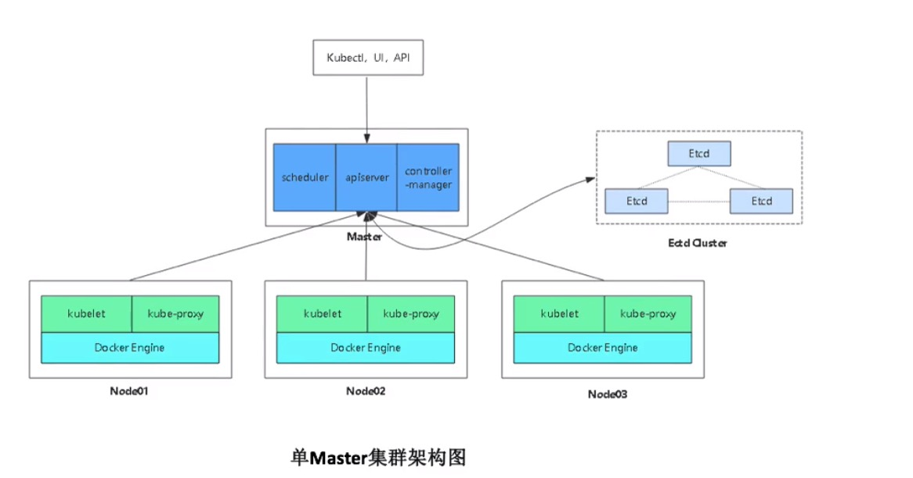
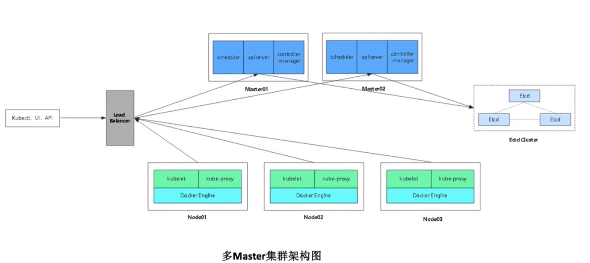

# Kubernetes v1.25 企业级高可用集群自动部署（离线版）
>### 注：确保所有节点系统时间一致
>### 操作系统要求：CentOS7.x_x64

### 1、找一台服务器安装Ansible
```
# yum install epel-release -y
# yum install ansible -y
```
### 2、下载所需文件

下载Ansible部署文件：

```
# git clone https://gitee.com/scajy/ansible-install-k8s.git
# cd ansible-install-k8s
```

下载准备好软件包（包含所有涉及文件和镜像，比较大），解压到/root目录：

链接: https://pan.baidu.com/s/1c5jVPMfOkD4hS406sZFMMg 
提取码: gflj

```
# tar zxf binary_pkg_1.25.tar.gz
# mv binary_pkg_1.25 binary_pkg
```
> 注：百度网盘下载的所需的分发的安装包，一定要放到root目录下，并更改解压包名，放在其他目录请更改ansible配置

### 3、修改Ansible文件

修改hosts文件，根据规划修改对应IP和名称。

```
# vi hosts
...
```
修改group_vars/all.yml文件，修改软件包目录和证书可信任IP。

```
# vim group_vars/all.yml
software_dir: '/root/binary_pkg'
...
cert_hosts:
  k8s:
  etcd:
```
## 4、一键部署
### 4.1 架构图
单Master架构



多Master架构



### 4.2 部署命令
单Master版：
```
# ansible-playbook -i hosts single-master-deploy.yml -uroot -k
```
多Master版：
```
# ansible-playbook -i hosts multi-master-deploy.yml -uroot -k
```

## 5、查看集群节点
```
# kubectl get node
NAME          STATUS   ROLES    AGE   VERSION
k8s-master1   Ready    <none>   9h    v1.25.2
k8s-node1     Ready    <none>   9h    v1.25.2
k8s-node2     Ready    <none>   9h    v1.25.2
```

## 6、其他
### 6.1 部署控制
如果安装某个阶段失败，可针对性测试.

例如：只运行部署插件
```
# ansible-playbook -i hosts single-master-deploy.yml -uroot -k --tags addons
```

### 6.2 节点扩容
1）修改hosts，添加新节点ip

```
# vi hosts
...
[newnode]
192.168.0.185 node_name=k8s-node3
```
2）执行部署
```
# ansible-playbook -i hosts add-node.yml -uroot -k
```
### 6.3 所有HTTPS证书存放路径
部署产生的证书都会存放到目录“ansible-install-k8s-master/ssl”，一定要保存好，后面还会用到~
